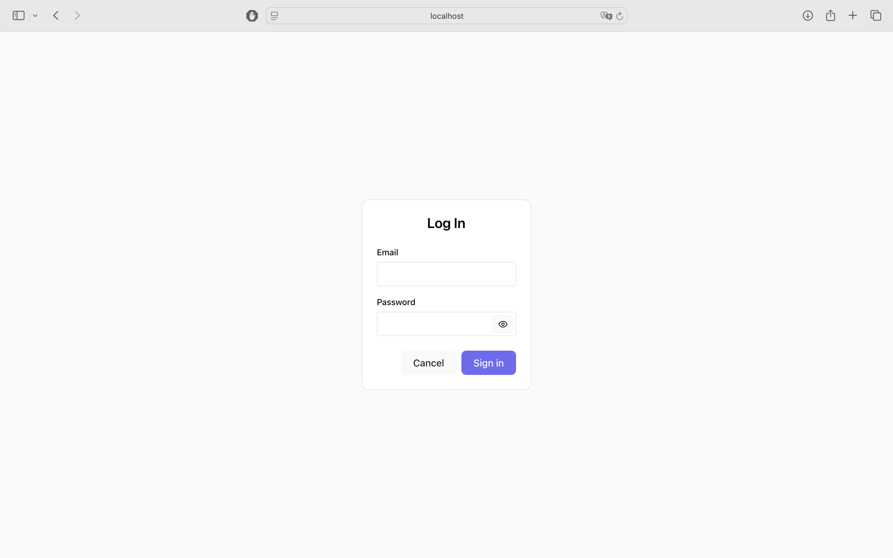
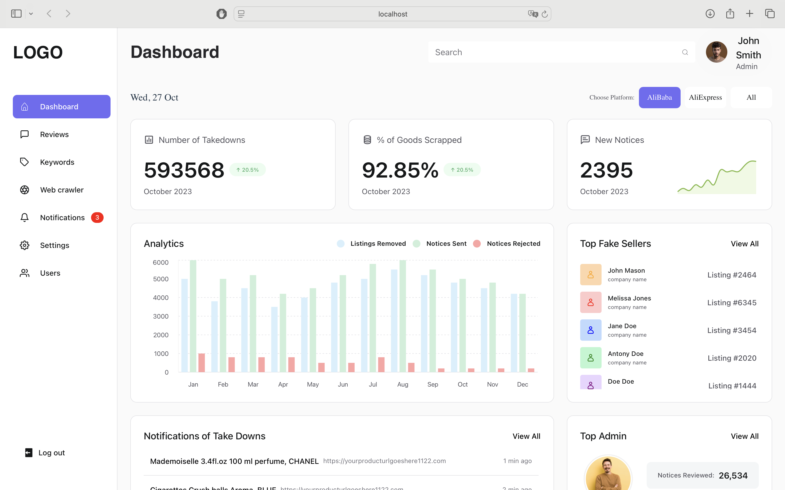
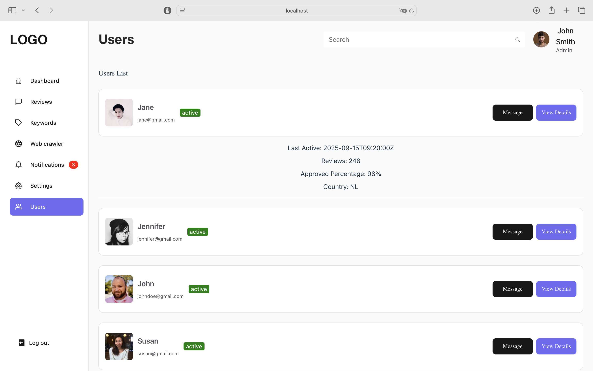

<h1 align="center">
  <a href="#"> React Admin Panel </a>
</h1>

<h3 align="center">A responsive admin panel built with React, Chakra UI, and Recharts.js</h3>

<h4 align="center"> 
	 Status: In Progress (needs cleanup)
</h4>

<p align="center">
 <a href="#about">About</a> •
 <a href="#features">Features</a> •
 <a href="#tech-stack">Tech Stack</a> •  
 <a href="#license">License</a> •  
 <a href="#get-in-touch">Contact</a> • 
 
</p>

## About

This project was built as part of my learning journey in frontend development with <strong>React</strong> and <strong>JavaScript</strong>. The goal was to practice building a modern, responsive web application from scratch while applying key concepts such as component-based architecture, state management with hooks, and client-side routing.

I also explored <strong>Chakra UI</strong> for theming and styling, and <strong>Recharts.js</strong> for data visualization. While the core functionality is complete, the codebase is currently being refactored and cleaned up for improved readability and maintainability.

---

## Features

- [x] Responsive Layout
- [x] Handles Authentication
- [x] Interactive Charts built with Recharts.js
- [x] Grid View: card-based layout to display items.
- [x] List View: table-style layout adapted to display user details.
- [x] Client-Side Routing → smooth navigation between pages using React Router.
      
---

## Screenshots  

#### Login  
  

#### Dashboard  
  

#### Reviews Grid View  
  

#### Reviews List View  
  

#### Users List View  
  


### Pre-requisites

Before you begin, you will need to have <a href="https://nodejs.org/en/">Node.js</a> installed.
Additionally, it is good to have an editor to work with the code like <a href="https://code.visualstudio.com">VSCode</a>

#### Running the web application (Frontend)

```bash

# Clone this repository
$ git clone https://github.com/ShadmanSahil/react-admin-panel/

# Access the project folder in your terminal
$ cd react-admin-panel

# Install the dependencies
$ npm install

# Run the application in development mode
$ npm run dev

# The application will open on the port: 8000 - go to http://localhost:8000

```

---

## Tech Stack

The following tools were used in the construction of the project:

#### **Platform** ([React](https://reactjs.org/) + [TypeScript](https://www.typescriptlang.org/))

- [React Dom](https://www.npmjs.com/package/react-dom)
- [React Router Dom](https://reactrouter.com)
- [React Icons](https://react-icons.github.io/react-icons/)
- [Chakra UI](https://chakra-ui.com)
- [Vite](https://vite.dev)
- [Visual Studio Code](https://code.visualstudio.com/)

> See the file [package.json](https://github.com/ShadmanSahil/react-admin-panel/package.json)

---

## License

This project is under the license [MIT](./LICENSE).

## Get in Touch!

👋🏽 [Say Hi!](https://www.linkedin.com/in/evelinsteiger/)


